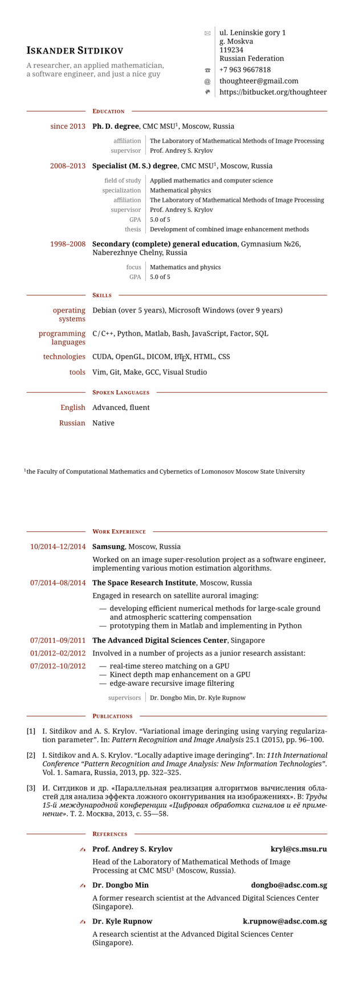

# Tidy CV

An unsophisticated yet neatly crafted LaTeX class for the CV.

## License

**Tidy CV** is released under the MIT license.

## Requirements

You can find the list of required packages in `tidycv.cls`.

## Usage

Provided `Makefile` uses the latex-biber-latex-dvips-ps2pdf pipeline to compile
the document into a PDF (make sure that all of these utilities present in your
system):
```console
$ make
```
It also allows to remove all non-essential files from the directory (be
very careful with it):
```console
$ make clean
```
and create a PNG snapshot of the document using ImageMagick:
```console
$ make snapshot
```
You can change the target language by passing an additional argument:
```console
$ make language=russian
```

My actual CV given in `cv.tex` and `publications.bib` may serve as a good
starting point for your own one. Good luck!


